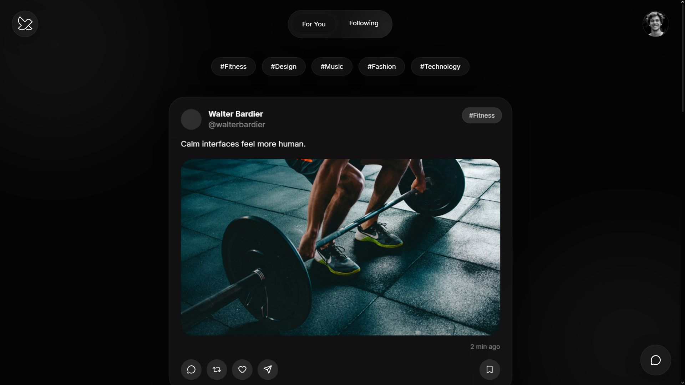
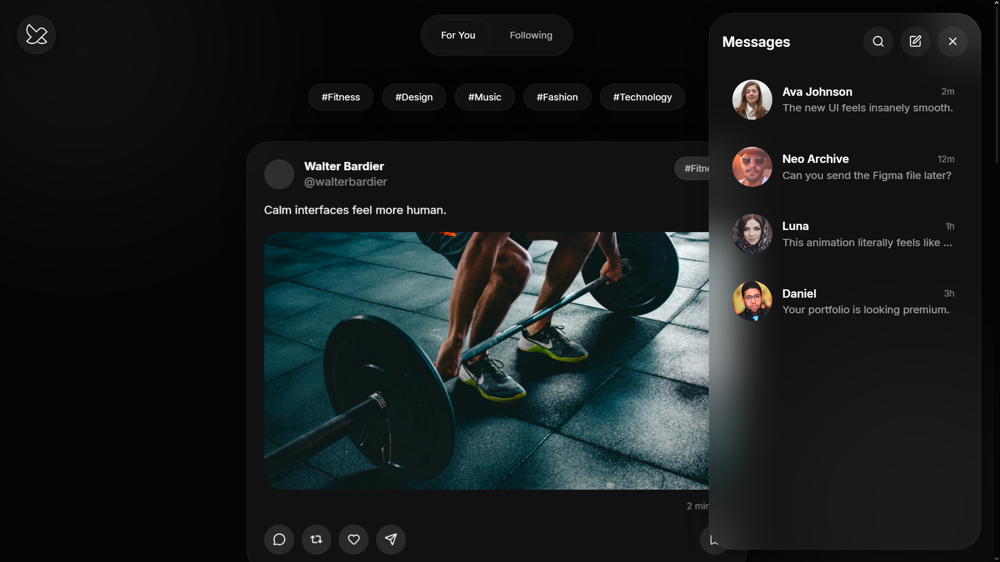
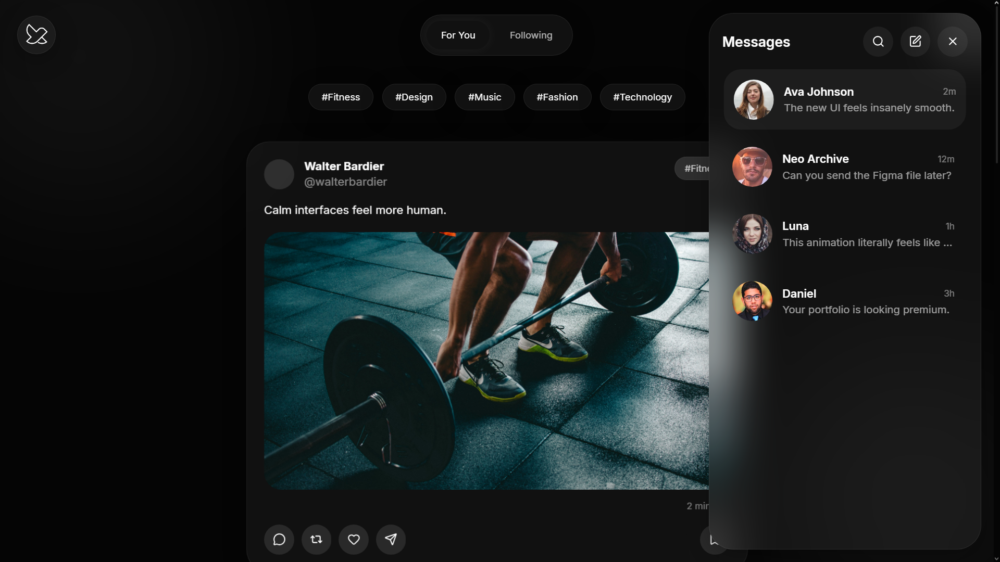
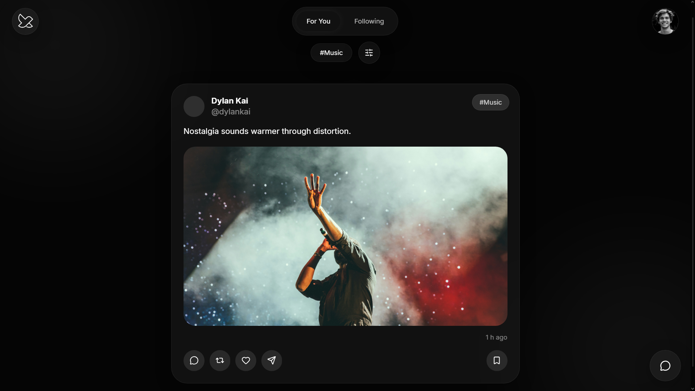
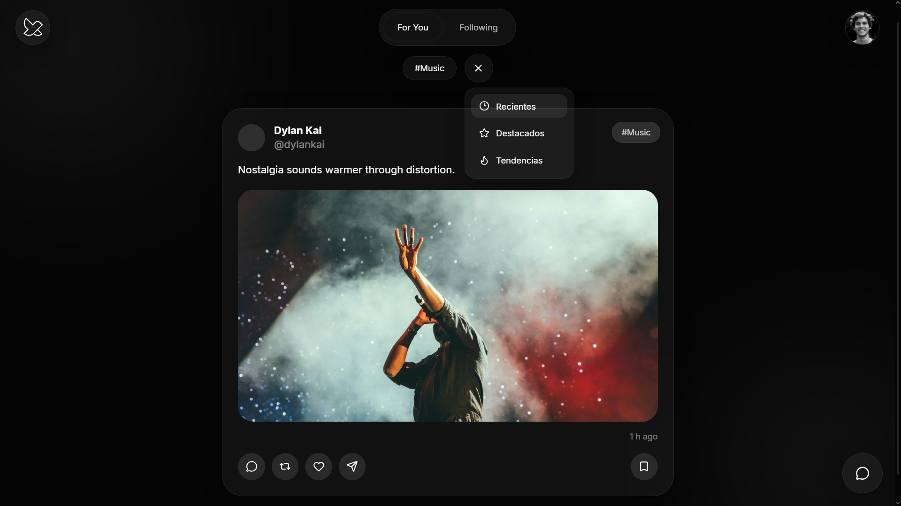
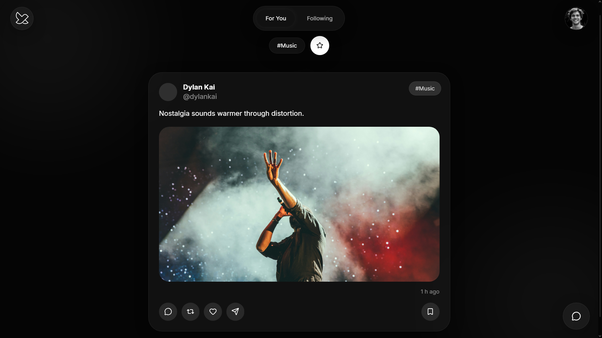
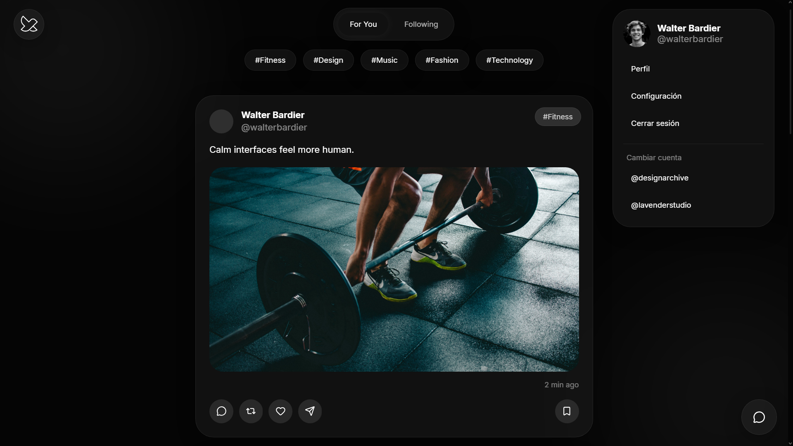
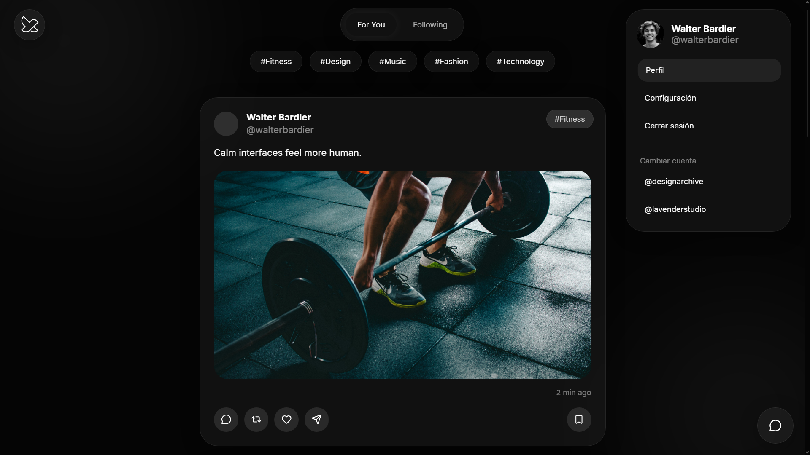

# 🧠 X Redesign

X Redesign is a UX/UI case study that reimagines the X (Twitter) interface with a focus on clarity, smoother interactions, and reduced cognitive overload. It explores a more modern, fluid, and visually rich social experience using glassmorphism-inspired UI and motion design.

The goal is to improve feed readability, hierarchy, and interaction flow while creating a calmer and more premium browsing experience through spacing, animation, and microinteractions.

This project was built as a practice case study to strengthen frontend development, UI/UX thinking, and motion design using React and Framer Motion.

## ✨ Features

- 📰 Redesigned social feed with cleaner hierarchy  
- 💬 Tweet modal with smooth transitions  
- 🖼️ Fullscreen image viewer  
- 🎭 Glassmorphism UI system  
- 💫 Microinteractions with Framer Motion  
- 🎯 Topic-based filtering system  
- 📱 Fully responsive design  

## 🧰 Tech Stack

- React  
- Framer Motion  
- Lucide Icons  
- CSS (custom glassmorphism styling)

## ⚙️ Notes

- This is a UI/UX redesign concept, not an official X product.

## 📸 Screenshots

### Feed



### Messages



### Topics




### Profile




## 🚀 Live Demo

https://x-redesign.vercel.app


## 📦 Installation

```bash
git clone https://github.com/walterbardier/x-redesign.git
cd x-redesign
npm install
npm run dev